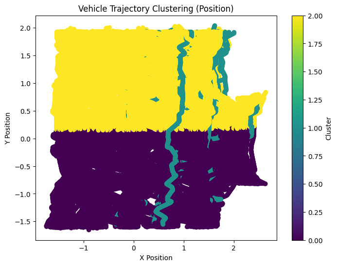
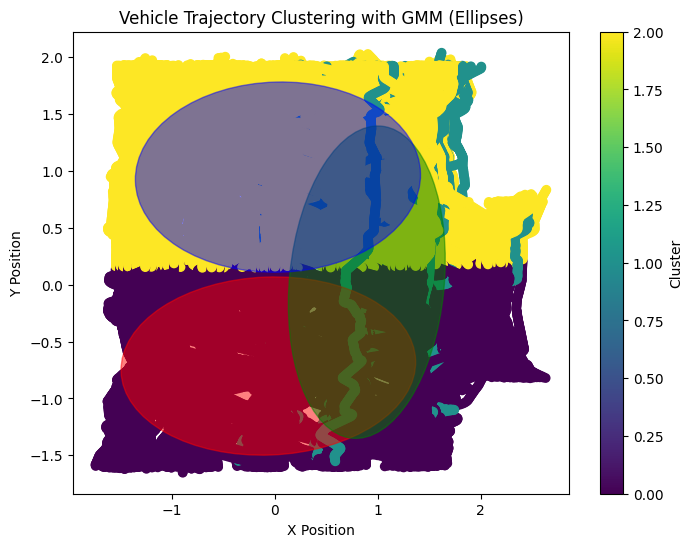
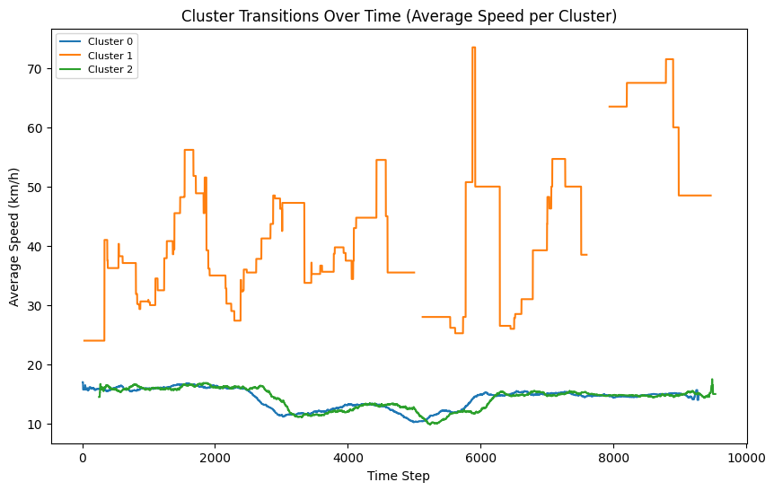
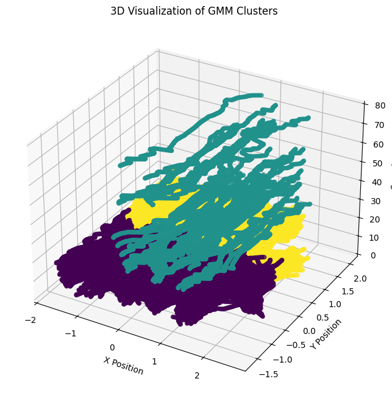

# Gaussian Mixture Model (GMM) using Expectation Maximization (EM)

## Overview

A Gaussian Mixture Model (GMM) is a probabilistic model that assumes that the data is generated from a mixture of several Gaussian distributions. The model is particularly useful for clustering, density estimation, and anomaly detection.

This repository provides an implementation of Gaussian Mixture Models (GMM) using the Expectation-Maximization (EM) algorithm to estimate the parameters of the mixture model.

A Gaussian Mixture Model (GMM) is a mixture model that represents the data as a combination of multiple Gaussian distributions, each with its own mean and covariance. The model assumes that each data point is generated from one of the Gaussian distributions, but the distribution it belongs to is unknown.

The Expectation-Maximization (EM) algorithm is used to iteratively estimate the parameters of the Gaussian distributions, including the means, covariances, and mixture weights.

## Key Features

- Expectation Maximization: Iterative algorithm to estimate GMM parameters.
- Clustering: Group data into K clusters, each modeled by a Gaussian.
- Density Estimation: Learn the distribution of data based on mixture of Gaussians.
- Anomaly Detection: Identifying data points that don't fit the learned distribution.

## Algorithm

1. Expectation Step (E-Step): Calculate the responsibility that each Gaussian component has for each data point.
2. Maximization Step (M-Step): Update the parameters (mean, covariance, and mixture weights) based on the responsibilities calculated in the E-step.

This is repeated iteratively until convergence is met.

## Dataset

### NGSIM Vehicle Trajectory Data - US-101

This implementation uses the NGSIM Vehicle Trajectory Data, which is provided by KaggleHub. The dataset contains detailed vehicle trajectory data collected on the US-101 freeway in California.

Dataset URL: [NGSIM Vehicle Trajectory Data - US-101](https://www.kaggle.com/datasets/nigelwilliams/ngsim-vehicle-trajectory-data-us-101)

### Dataset Overview

The dataset includes vehicle trajectories collected from the US-101 freeway during a 3-hour period, and contains several attributes including:

- Vehicle ID: A unique identifier for each vehicle.
- Time: The timestamp of the data collection.
- X and Y Position: The position of the vehicle in 2D space (coordinates).
- Speed: The speed of the vehicle.
- Lane: The lane the vehicle is traveling in.

  The dataset is useful for vehicle behavior analysis, traffic flow prediction, and trajectory clustering tasks, making it ideal for clustering with Gaussian Mixture Models (GMM).

## Results

After running the EM algorithm, the GMM will output:

- Means: Estimated means of the Gaussian distributions.
- Covariances: Estimated covariance matrices of each Gaussian component.
- Weights: Mixing coefficients that define the probability of each Gaussian component.

